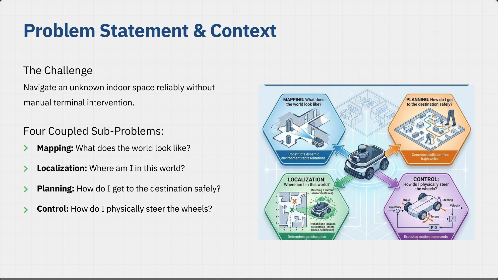
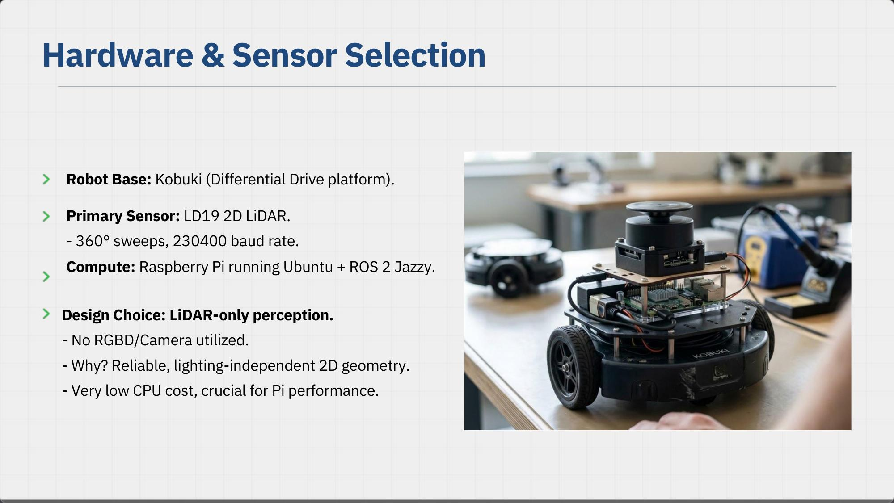
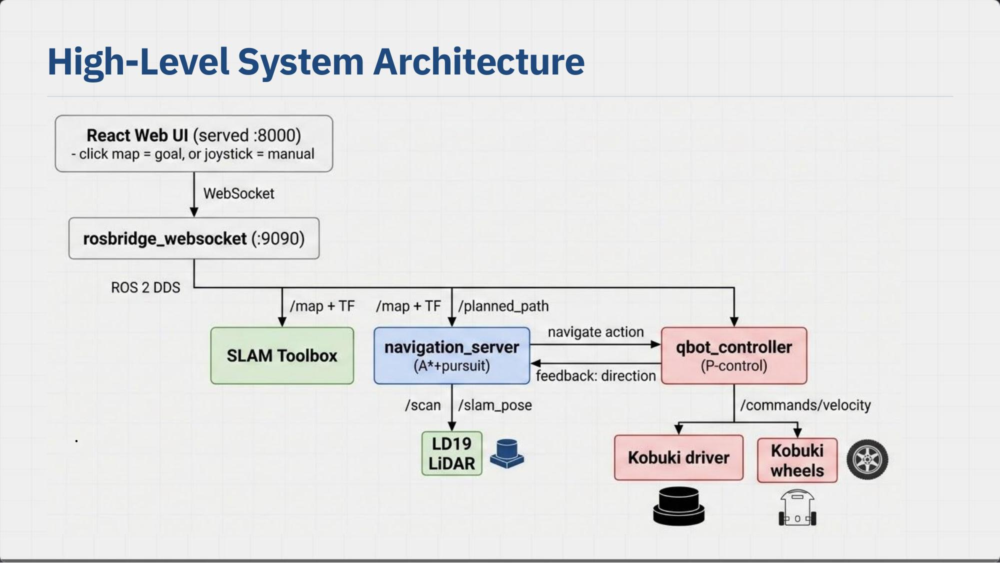
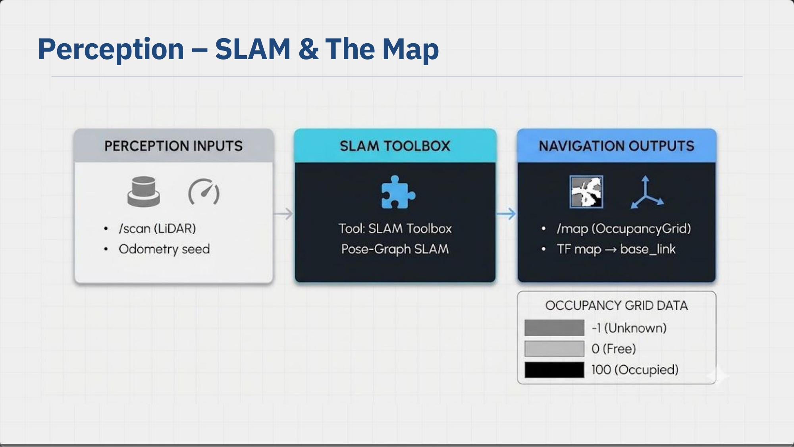
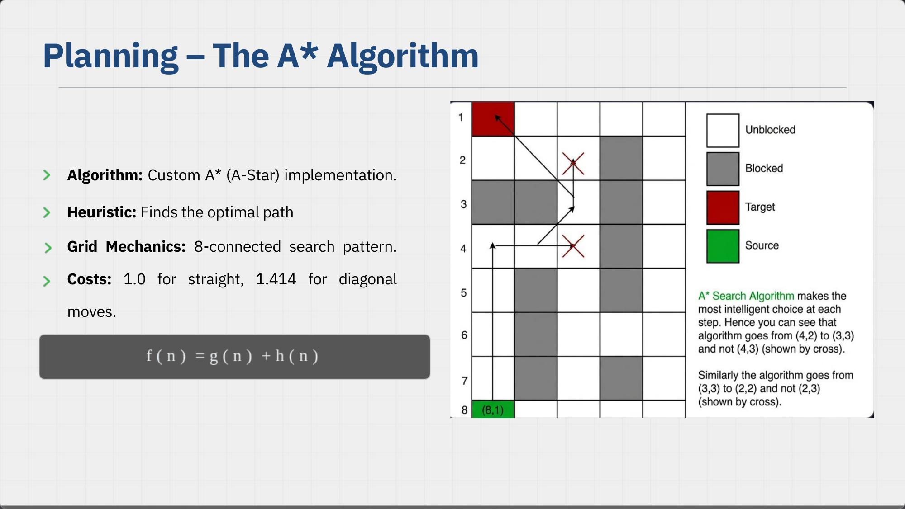
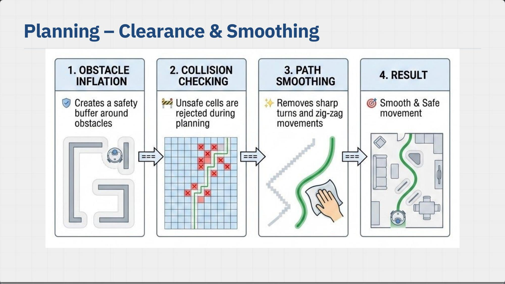
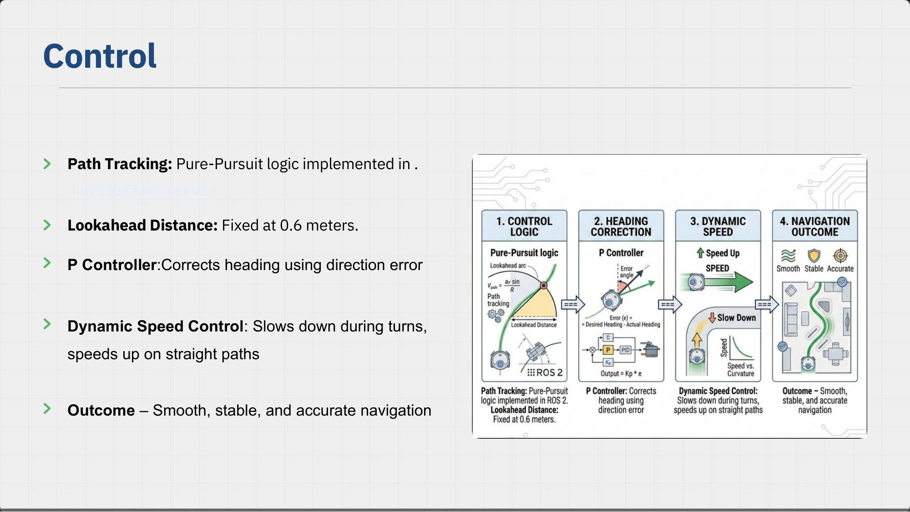
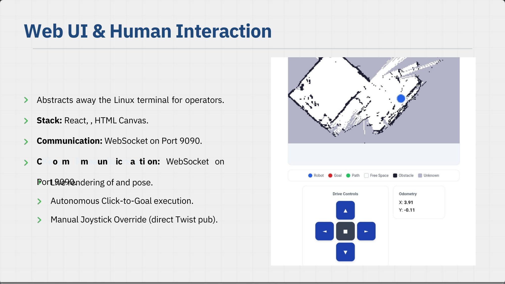

# QBot Navigation System

A ROS 2 Jazzy-based autonomous indoor navigation and mapping system for the Kobuki robot, using an LD19 2D LiDAR, SLAM Toolbox, a custom A* path planner, Pure-Pursuit control, and a web-based React user interface.



**The Challenge:** Navigate an unknown indoor space reliably without manual terminal intervention, by solving four coupled sub-problems:

* **Mapping** — What does the world look like?
* **Localization** — Where am I in this world?
* **Planning** — How do I get to the destination safely?
* **Control** — How do I physically steer the wheels?

---

## Hardware & Sensor Selection



* **Robot Base:** Kobuki (differential-drive platform)
* **Primary Sensor:** LD19 2D LiDAR — 360° sweeps, 230,400 baud rate
* **Compute:** Raspberry Pi running Ubuntu + ROS 2 Jazzy
* **Design Choice — LiDAR-only perception:** no RGBD/camera is used.
  * Reliable, lighting-independent 2D geometry
  * Very low CPU cost, which matters a lot on a Raspberry Pi

---

## Prerequisites

* Ubuntu on Raspberry Pi
* ROS 2 Jazzy
* Kobuki Base
* LD19 LiDAR
* Built workspace (`kobuki_ws`)
* Built React frontend (`build` directory)

---

## High-Level System Architecture



```text
React Web UI (served :8000)
      │  click map = goal, or joystick = manual
      ▼
rosbridge_websocket (:9090)
      │
      ▼ ROS 2 DDS
 ┌───────────────┬────────────────────┬───────────────────┐
 │               │                    │                   │
 ▼               ▼                    ▼                   │
SLAM Toolbox   navigation_server   qbot_controller          │
 (map + TF)    (A* + pursuit)      (P-control)              │
 ▲              │      ▲navigate action │                  │
 │/scan          │/planned_path ◄───────┘feedback: direction│
 │               │                                          │
LD19 LiDAR    /slam_pose                            /commands/velocity
                                                              │
                                                    Kobuki driver / wheels
```

---

## Starting the System

The system requires three separate terminals.

### Terminal 1: Launch the Hardware Stack

This command:

* Connects to the Kobuki base
* Starts the LD19 LiDAR
* Launches the SLAM mapping system
* Starts the A* Navigation Server

```bash
cd ~/Desktop/ROS2_Final_Project/kobuki_ws
source /opt/ros/jazzy/setup.bash
source install/setup.bash
ros2 launch qbot_nav qbot_hardware.launch.py
```

---

### Terminal 2: Start the WebSocket Bridge

This allows communication between the React web interface and ROS 2 using Rosbridge.

```bash
cd ~/Desktop/ROS2_Final_Project/kobuki_ws
source /opt/ros/jazzy/setup.bash
source install/setup.bash
ros2 run rosbridge_server rosbridge_websocket --ros-args -p port:=9090
```

---

### Terminal 3: Serve the React User Interface

This hosts the compiled React application using Python's lightweight HTTP server.

```bash
cd ~/Desktop/ROS2_Final_Project/build
python3 -m http.server 8000
```

---

## Accessing the Web Interface

After all services are running, open a web browser on a device connected to the same Wi-Fi network as the Raspberry Pi.

Navigate to:

```text
http://<RASPBERRY_PI_IP>:8000
```

Example:

```text
http://192.168.8.154:8000
```

---

## Finding the Raspberry Pi IP Address

Run:

```bash
hostname -I
```

Example output:

```text
192.168.8.154
```

Use the displayed IP address in your browser:

```text
http://192.168.8.154:8000
```

---

## Perception — SLAM & The Map



| Stage | Detail |
|---|---|
| **Inputs** | `/scan` (LiDAR), odometry seed |
| **Tool** | SLAM Toolbox — pose-graph SLAM |
| **Outputs** | `/map` (OccupancyGrid), TF `map → base_link` |

**Occupancy grid values:**

| Value | Meaning |
|---|---|
| `-1` | Unknown |
| `0` | Free |
| `100` | Occupied |

---

## Planning — The A* Algorithm



* **Algorithm:** Custom A* (A-Star) implementation
* **Heuristic:** Finds the optimal path
* **Grid mechanics:** 8-connected search pattern
* **Costs:** `1.0` for straight moves, `1.414` for diagonal moves

```text
f(n) = g(n) + h(n)
```

A* always makes the lowest-cost choice at each step — for example, it will expand from (4,2) to (3,3) rather than (4,3), and from (3,3) to (2,2) rather than (2,3), when the diagonal move is cheaper/optimal given the heuristic.

### Clearance & Smoothing



1. **Obstacle Inflation** — creates a safety buffer around obstacles
2. **Collision Checking** — unsafe cells are rejected during planning
3. **Path Smoothing** — removes sharp turns and zig-zag movements
4. **Result** — a smooth, safe path for the robot to follow

---

## Control



* **Path Tracking:** Pure-Pursuit logic implemented in ROS 2
* **Lookahead Distance:** fixed at 0.6 meters
* **P Controller:** corrects heading using the direction error
* **Dynamic Speed Control:** slows down during turns, speeds up on straight paths
* **Outcome:** smooth, stable, and accurate navigation

Control pipeline: Pure-Pursuit control logic → P-controller heading correction (`Output = Kp * e`) → dynamic speed vs. curvature adjustment → smooth/stable/accurate navigation.

---

## Integration

* **ROS 2 Nodes** launched from a single launch file
* **Custom Navigation Action** connects planning and control
* **TF2 Coordinate Frames** provide a shared robot position
* **Lifecycle Management** ensures reliable startup
* **Multi-threaded Execution** handles navigation and sensor updates simultaneously
* **ROSBridge Integration** connects ROS 2 with the React web interface

---

## Web UI & Human Interaction



* Abstracts away the Linux terminal for operators
* **Stack:** React + HTML Canvas
* **Communication:** WebSocket on port 9090
* Live rendering of map and robot pose
* Autonomous click-to-goal execution
* Manual joystick override (direct Twist publish)

---

## System Architecture Diagram (text)

```text
React Web UI
      │
      ▼
Rosbridge WebSocket (Port 9090)
      │
      ▼
ROS 2 Jazzy
      │
 ┌────┴────┐
 │         │
 ▼         ▼
SLAM     A* Navigation
 │
 ▼
LD19 LiDAR
 │
 ▼
Kobuki Base
```

---

## Results & Performance

* **Accuracy:** Successfully plans, smooths, and halts within the defined `waypoint_tolerance` of 0.35 m
* **Safety & Rejection:** Inflation checks successfully reject clicks inside mapped walls, aborting the action safely
* **Dynamic Redirection:** The action client seamlessly cancels old threads and redirects the robot on mid-route goal clicks

---

## Known Engineering Challenges

* **TF Tree Setup:** Default simulator time settings broke TF until explicitly forcing hardware clock/frames in the launch file
* **Inflation Cost:** A 7x7 scan on every A* neighbor expansion is heavy per cell
* **Map Freezing:** Deliberate scope choice to "freeze" the map during navigation to protect cell indices (this prevents dynamic replanning)
* **The "Unknown Space" Edge Case:** Unmapped grey cells (`-1`) currently pass inflation checks, allowing potential planning into unknown territory

## Future Improvements

* **Pre-computed Costmap:** Inflate obstacles globally once before A* runs, to solve the per-cell expansion bottleneck
* **Reactive Avoidance:** Handle dynamic, unmapped obstacles (e.g., humans) stepping into the robot's immediate path
* **Continuous Replanning:** Unfreeze the map and replan at high frequency to adapt to newly mapped boundaries
* **Strict Cell Rejection:** Explicitly block planning into unknown (`-1`) cells in the validation function

---

## Troubleshooting

### Web UI Cannot Connect

Verify the Rosbridge server is running:

```bash
ros2 node list
```

You should see:

```text
/rosbridge_websocket
```

---

### Cannot Access the Web Interface

Check that the Python server is running:

```bash
ps aux | grep http.server
```

Verify the Raspberry Pi IP address:

```bash
hostname -I
```

Ensure the client device is connected to the same Wi-Fi network.

---

### Verify ROS 2 Nodes

```bash
ros2 node list
```

---

## Ports Used

| Service             | Port |
| ------------------- | ---- |
| React Web UI        | 8000 |
| Rosbridge WebSocket | 9090 |

---

## Shutdown

To stop the system safely, press:

```bash
Ctrl + C
```

in each terminal window.
